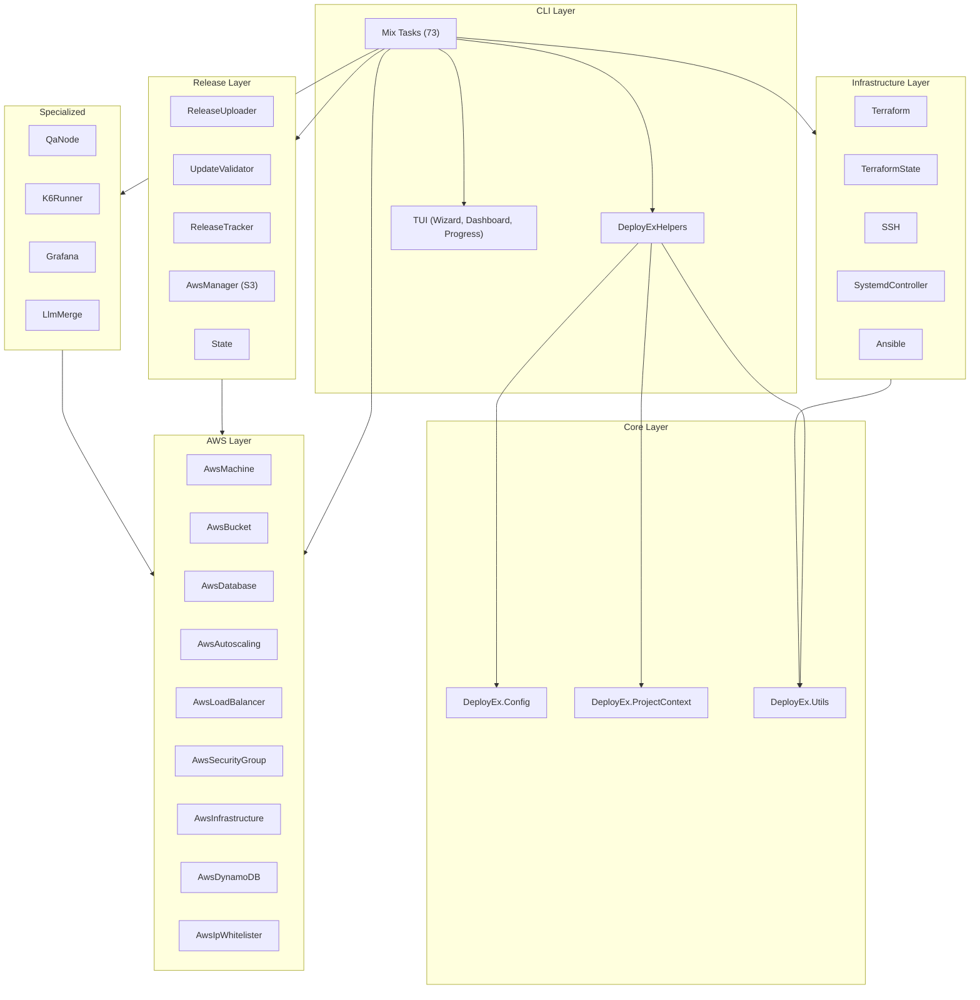
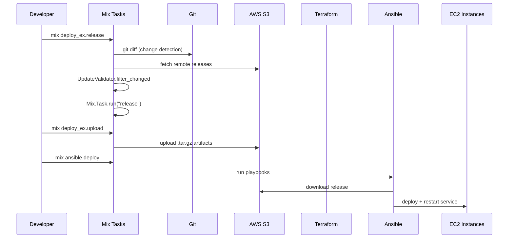
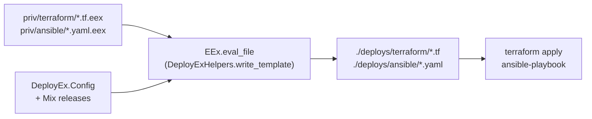
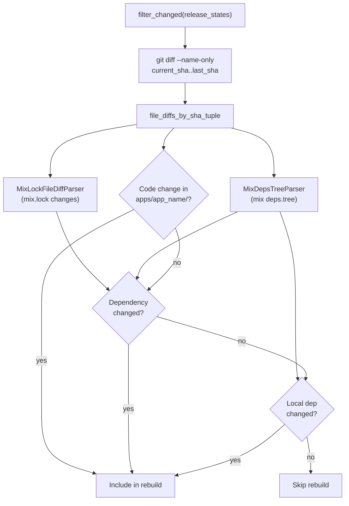
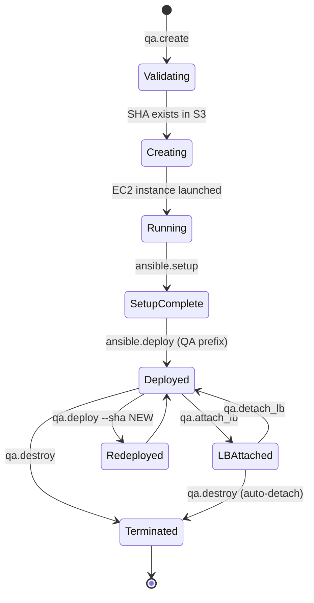

# System Architecture

## Architectural Layers

## Deployment Data Flow

## Template Pipeline

Template files in `priv/` are rendered with project-specific variables (app names, AWS region, bucket names, feature flags) into `./deploys/`. Once generated, these files are user-owned — deploy_ex tracks modifications via SHA256 manifest (`.deploy_ex_manifest.exs`) for intelligent upgrades.

## Release Change Detection

For single-app projects, code changes are detected via `lib/`, `test/`, `priv/` paths instead of `apps/<name>/`.

## QA Node Lifecycle

QA node state is persisted to S3 at `qa-nodes/{app_name}/{instance_id}.json`.

## S3 Bucket Layout

| Bucket | Content | Key Pattern |
|--------|---------|-------------|
| `{project}-elixir-deploys-{env}` | Release artifacts | `{app_name}/{timestamp}-{sha}-{filename}.tar.gz` |
| `{project}-elixir-release-state-{env}` | Release tracking | `release-state/{prefix}/{app_name}/current_release.txt` |
| `{project}-backend-logs-{env}` | Application logs | Loki-managed |

## Module Size by Subsystem

| Subsystem | Modules | LOC | Key Files |
|-----------|---------|-----|-----------|
| AWS | 9 | ~1,950 | aws_machine.ex (446), aws_autoscaling.ex (406) |
| TUI | 7 | ~1,630 | command_registry.ex (866), wizard.ex (394) |
| Specialized | 5 | ~1,140 | qa_node.ex (603), k6_runner.ex (428) |
| Infrastructure | 8 | ~700 | terraform.ex (175), ssh.ex (134), utils.ex (187) |
| Release | 8 | ~430 | release_uploader.ex (149), update_validator.ex (256) |

See also: [Code Standards](code-standards.md) | [API Reference](api-reference.md) | [Configuration Guide](configuration-guide.md)
