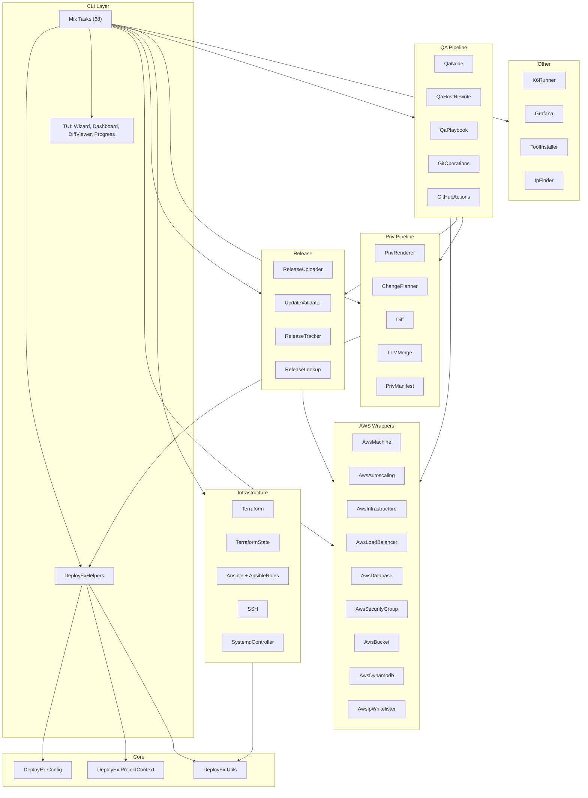
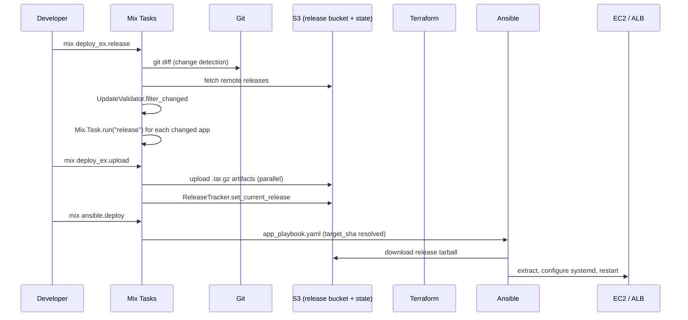
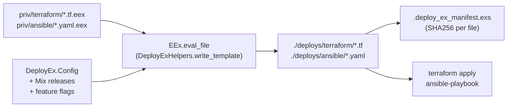
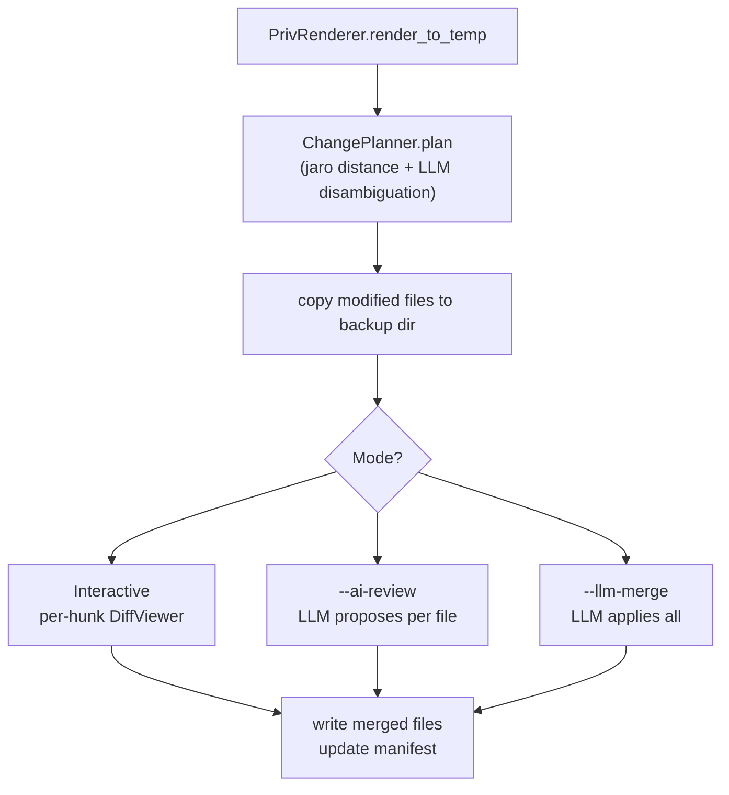
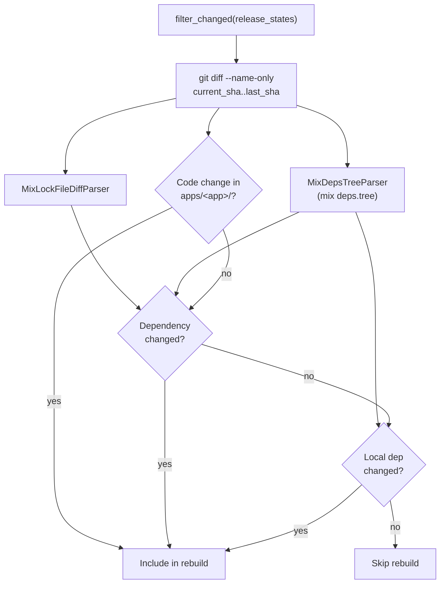
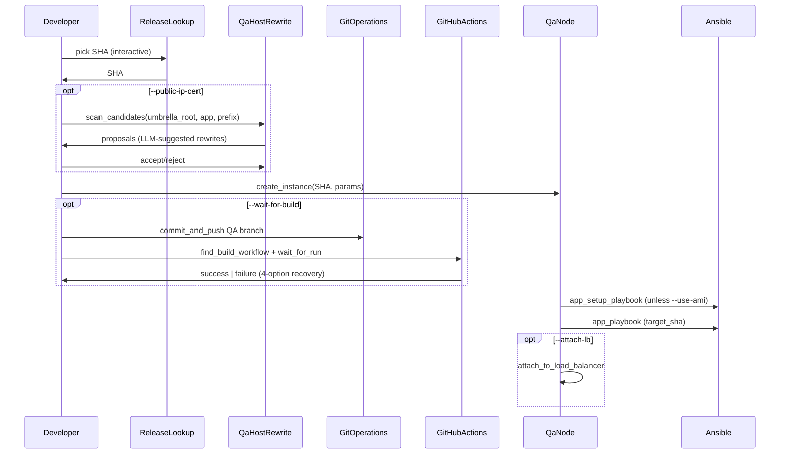
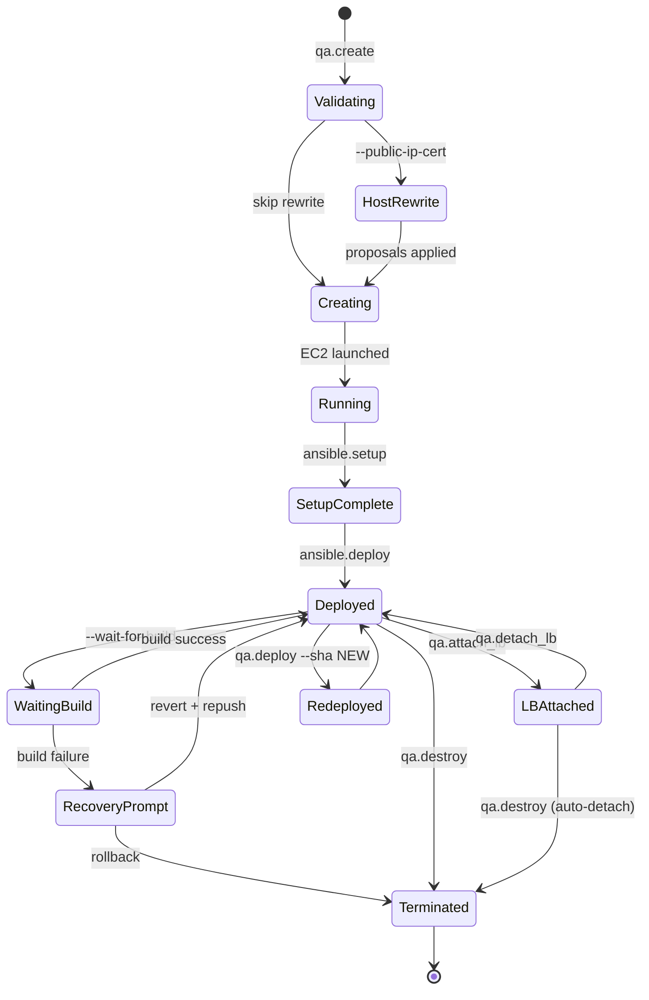
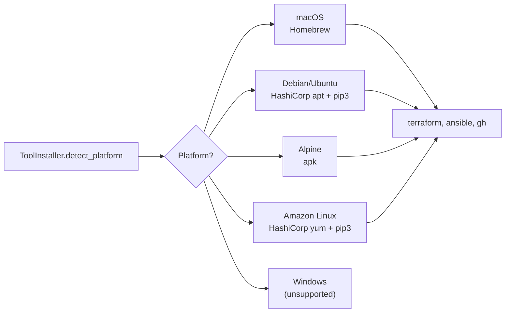

# System Architecture

## Architectural Layers

## Deployment Data Flow

## Template Pipeline

`mix deploy_ex.export_priv` writes the rendered tree to `./deploys/` and records every file's SHA256 in `.deploy_ex_manifest.exs`. After that, you own those files. `mix deploy_ex.upgrade_priv` re-renders to a temp dir and uses `ChangePlanner` to figure out what changed.

## Priv Upgrade Pipeline

`ChangePlanner` classifies each upstream file vs. user file as one of: `:identical`, `:update`, `:rename`, `:split`, `:merge_files`, `:new`, `:removed`, `:user_only`. High Jaro similarity (>= 0.8) → rename; split (>= 0.65) → split; moderate (0.4-0.8) → ask the LLM; everything else → new/removed.

## Release Change Detection

For single-app projects, code changes are detected via `lib/`, `test/`, `priv/` paths instead of `apps/<name>/`.

## QA Pipeline

State for every QA node is persisted to S3 at `qa-nodes/<app>/<instance_id>.json` and mirrored on the EC2 tags (`UsePublicIpCert`, `TargetSha`, `InstanceTag`, …). Multiple developers see the same fleet.

## QA Node Lifecycle

## S3 Bucket Layout

| Bucket | Content | Key pattern |
|--------|---------|-------------|
| `<project>-elixir-deploys-<env>` | Release artifacts | `[qa/]<app>/<timestamp>-<sha>-<filename>.tar.gz` |
| `<project>-elixir-release-state-<env>` | Release tracking + QA state | `release-state/[qa/]<app>/current_release.txt`, `release-state/[qa/]<app>/release_history.txt`, `qa-nodes/<app>/<instance-id>.json` |
| `<project>-backend-logs-<env>` | Loki-managed app logs | (managed by Loki) |
| `<project>-terraform-state-<env>` | Terraform state | `<env>/terraform.tfstate` |

QA artifacts and state share the same buckets but use the `qa/` prefix so prod tooling can ignore them.

## Tooling Layer

`mix ansible.deploy` and `mix deploy_ex.qa.create --wait-for-build` call `ToolInstaller.ensure_installed(:ansible)` and `:gh` respectively before doing real work.

## See also

- [Code Standards](code_standards.md)
- [Mix Tasks Reference](../reference/mix_tasks.md)
- [Configuration Reference](../reference/configuration.md)
- [Codebase Summary](../reference/codebase_summary.md)
